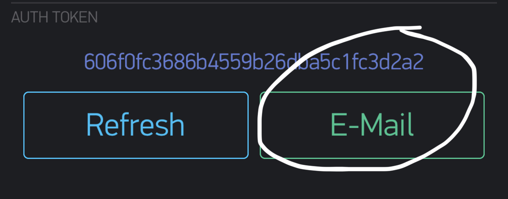

## LED - Show Message or Local Weather 

<video src="2.mp4" width="420" height="400" controls preload></video>

Required Parts:
<br>- Particle Photon
<br>- LED Module [link](https://www.amazon.com/gp/product/B01EJ1AFW8/ref=ppx_yo_dt_b_asin_title_o00_s00?ie=UTF8&psc=1)
<br>- 5 Male/Male Wires
<br>- OPTIONAL: PowerShield (Battery) [link](https://www.amazon.com/gp/product/B06XJ64G8G/ref=ppx_yo_dt_b_asin_title_o02_s00?ie=UTF8&psc=1)

### Step 1: SETUP WIFI & RESET PHOTON

<a href="https://iotrvc.github.io/reset/" target="blank">Click Here</a>

### Step 2: Connect Photo Sensor & Resistor to Photon
- Connect your sensor to a digital or analog input on the Photon. Follow these examples for hooking up common sensors.

```
Sensor Pin  | Photon Pin
       VCC | VIN  - BROWN
       GND | GND  - YELLOW
       DIN | D3   - TEAL
       CS  | D2   - YELLOW
       CLK | D1   - ORANGE
```

#### Set up the hardware


<br>

<br>

<br>
<hr>

### Step 3: Setup BLYNK APP

- Download iOS or Android App and setup account on BLYNK [link](https://blynk.io/en/getting-started)

<br>
- Tab Octagon icon <br>
- Tap E-Mail button to send Auth Token (See picture below)<br>
  
<br>

### Step 4: Create a Weather WebHook

- Go to [https://openweathermap.org/api](https://openweathermap.org/api) and sign-up
- Check email for your API & Copy (could take two hours to be ready to use)
- Go to [https://console.particle.io/integrations](https://console.particle.io/integrations)
- Click on New Integration
- Click WebHook > CUSTOM TEMPLATE
- Copy [text](https://raw.githubusercontent.com/iotrvc/MessageOrWeather/master/weather.txt) and replace YOURAPIGOESHERE with your API Token


- Select 'WebHook Builder' tab and select Device: Any
- Click Create WebHook

<hr>

### Step 5: Create Particle App

- Go to https://build.particle.io/build/new 
- Title: Remote_LED_Message_Center
- Add Library: blynk
- Add Library: ledmatrix-max7219-max7221
- Paste Below Code


```cpp

// This #include statement was automatically added by the Particle IDE.
#include <blynk.h>

// This #include statement was automatically added by the Particle IDE.
#include <ledmatrix-max7219-max7221.h>

// Simple LED Matrix Display with Blynk and Weather Integration 
// Uses 4x MAX7219 Dot Matrix Modules to display messages
// Make sure you add these two libraries using the Particle IDE


char auth[] = "BLYNKTOKEN"; // Check Your Email and Put your blynk token here from STEP 3 ABOVE

LEDMatrix *led;

int bitmapWidth = 8;   // 8 is default
int webcount = 900001;   // timer to run the weather webhook every 15 minutes

String strDefault = "Hello World";   // default string for display
String strText = "Hello RVCIOT Class";  //  default string for Blynk texts
String strWeather = ""; // default string for weather
String tb = "    ";//tab space for LED


int mode = 0;
int sleepTime = 60;
int textLength = strDefault.length();

// default position of the text is outside and then scrolls left
int textX = bitmapWidth;
int fontWidth = 5, space = 1;

void drawText(String s, int x)
{
  int y = 0;
  for(int i = 0; i < s.length(); i++) {
    // Adafruit_GFX method
    led->drawChar(x + i*(fontWidth+space), y, s[i], true, false, 1);
  }
}


void setup() {
  Blynk.begin(auth);   // setup Blynk 
  // setup pins and library
  // 1 display per row, 1 display per column
  // optional pin settings - default: CLK = A0, CS = A1, D_OUT = A2
  // (pin settings is independent on HW SPI)
  //led->setIntensity(0,8);
  led = new LEDMatrix(4, 1, D1, D2, D3); // my pins vary from the default
  // > add every matrix in the order in which they have been connected <
  // the first matrix in a row, the first matrix in a column
  // vertical orientation (-90°) and no mirroring - last three args optional
  // the Wangdd22 Matrix has 4 matrix elements, arranged side-by-side
  led->addMatrix(3, 0, 0, false, false);
  led->addMatrix(2, 0, 0, false, false);
  led->addMatrix(1, 0, 0, false, false);
  led->addMatrix(0, 0, 0, false, false);
  
  Particle.subscribe("hook-response/temp", gotWeatherData, MY_DEVICES);   // see particle.io tutorial on weather webhooks
   // This essentially starts the I2C bus
}

BLYNK_CONNECTED() {
    Blynk.syncAll();
}

// In the Blynk app, I used the Termianl widget on virtual pin V1 to send text messages for display.  
BLYNK_WRITE(V3){
    int Power = param.asInt();
      if (Power == 3) {
           led->shutdown(true);
    // free memory
    delete led;
    led = NULL;
         mode = 2;
      }
}

BLYNK_WRITE(V1) {
   String cmd = param[0].asStr();
   strText = cmd;
   Particle.publish("Message",strText,PRIVATE); 
}

// In the Blynk app, I used V2 as a button to toggle mode between weather and texts.
BLYNK_WRITE(V2){
    mode = param.asInt();
    if (mode == 0){
         Particle.publish("temp"); 
    }
}

// This collects data from my get_weather webhook, AccuWeather data in my example.  See the photon tutorial on webhooks to get other data.  https://docs.particle.io/tutorials/integrations/webhooks/

void gotWeatherData(const char *name, const char *data) {
    strWeather = String(data);
      Particle.publish("Weather",strWeather,PRIVATE); 
}

void loop() {
    Blynk.run();   

    if (webcount > 900000) {    // fetch data via the webhook every 15 (900000) minutes
        Particle.publish("temp"); 
        webcount = 0;
    }

// pick which text string will be displayed

    if (mode == 0) {
        strDefault = strWeather;
        strDefault = tb + strDefault;
        textLength = strDefault.length();
    }    
    
    if (mode == 1) {
        strDefault = strText;
        strDefault = tb + strDefault;
        textLength = strDefault.length();
    }
    if (mode == 2) {
    // here it does not work
      System.sleep(SLEEP_MODE_DEEP, sleepTime);
    }
    
    
    webcount = webcount + 1;
    
  if(led != NULL) {
    drawText(strDefault, textX--);
    // text animation is ending when the whole text is outside the bitmap
    if(textX < textLength*(fontWidth+space)*(-1)) {
      // set default text position
      textX = bitmapWidth;
      // show heart
      led->flush();
      delay(800);   // 1000 is default
      // turn all pixels off (takes effect after led->flush())
      led->fillScreen(false);
    }
    // draw text
    led->flush();
    delay(5);   // 125 is default 
  }
  // animations end
  else if (led != NULL) {
    // shutdown all displays
    led->shutdown(true);
    // free memory
    delete led;
    led = NULL;
  }

}


```

#### REMOTE_LED_MESSAGE
Get App Code: <a href="https://go.particle.io/shared_apps/5cfaf94033be4a0017ba1a20" target="blank">Click Here</a>


- Click Save
- Click Flash

That’s It! You should now be able to comntrol LED with Blynk App

- Tap "Text" Button > type message in Ternminal where you see 'Type here' and tap Send button

- Tap "Weather" Button > View Rockford Weather 

- Tap "Turn Off" Button > Put in low power mode for 1 minute

- Tap "Turn On" Button > Turn on LED after 1 minute


### TROUBLESHOOTING STEPS
<a href="https://iotrvc.github.io/troubleshooting/" target="blank">Click Here For TroubleShooting Steps</a>
