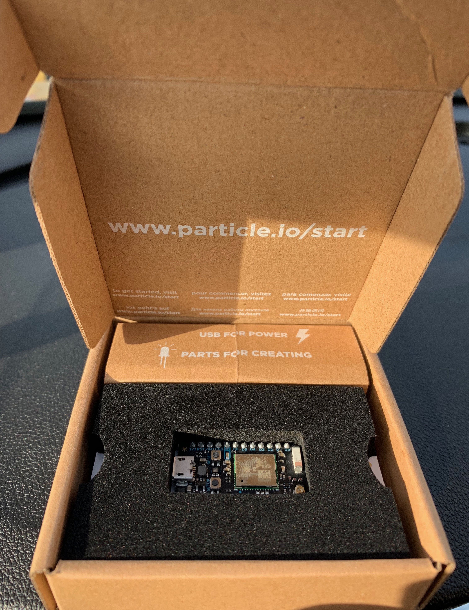
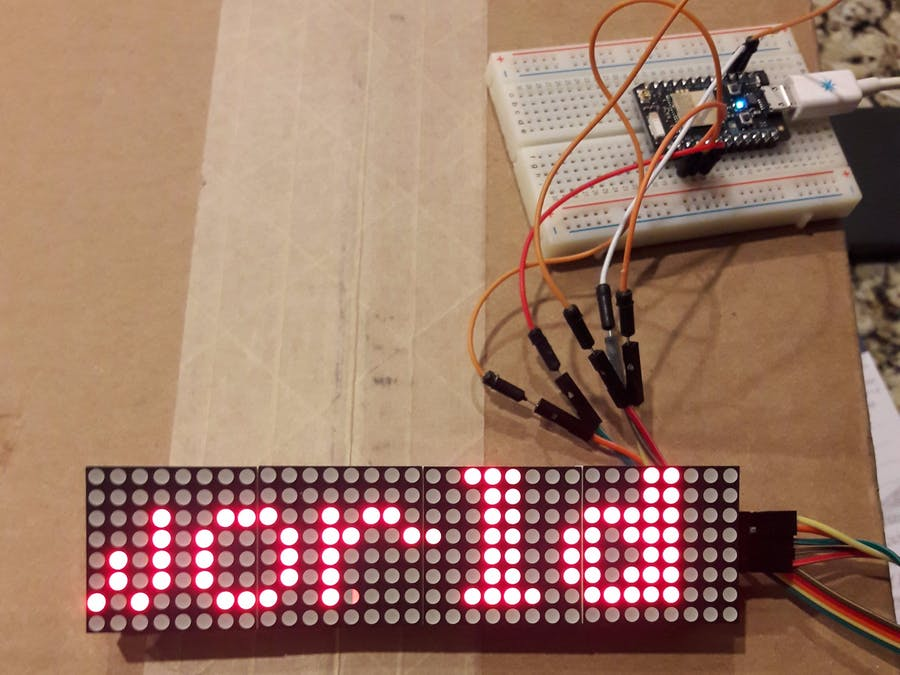

## LED - Show Message or Local Weather 

Required Parts:
<br>- Particle Photon
<br>- LED Module [link](https://www.amazon.com/gp/product/B01EJ1AFW8/ref=ppx_yo_dt_b_asin_title_o00_s00?ie=UTF8&psc=1)
<br>- OPTIONAL: PowerShield (Battery) [link](https://www.amazon.com/gp/product/B06XJ64G8G/ref=ppx_yo_dt_b_asin_title_o02_s00?ie=UTF8&psc=1)

### RESET PHOTONS
[reset photon](https://docs.particle.io/tutorials/device-os/led/core/#safe-mode)

### Step 1: Set up your Photon
- Using Your Computer: Go to particle.io/setup and follow the instructions to create an account and set up your Photon.
- Using Your Phone & Download the Particle Mobile App [iPhone](https://itunes.apple.com/us/app/particle-build-photon-electron/id991459054?ls=1&mt=8) & [Android](https://play.google.com/store/apps/details?id=io.particle.android.app) to create an account and set up your Photon.



<hr>

### Step 2: Connect Photo Sensor & Resistor to Photon
- Connect your sensor to a digital or analog input on the Photon. Follow these examples for hooking up common sensors.

```
Sensor Pin  | Photon Pin
       VCC | VIN
       GND | GND
       CLK | D1 
       CS  | D2 
       DN  | D3 
       
```

#### Set up the hardware


<br>
<hr>

### Step 3: Setup BLYNK APP

- Download iOS or Android App and setup account on BLYNK (link)[https://blynk.io/en/getting-started]

<br>
- Tab Octagon icon 
  * Add Photon Device
  * Tap email to send Auth Token (We will use later)
  

### Step 4: Create a Weather WebHook

- Go to https://openweathermap.org/api and sign-up
- Check email for your API & Copy
- Go to https://console.particle.io/integrations 
- Click on New Integration
- Click WebHook > CUSTOM TEMPLATE
- Paste below text and replace user and token with above user key and API Token

```
{
    "event": "temp",
    "url": "http://api.openweathermap.org/data/2.5/weather?q=Rockford,US&APPID=YOURAPIGOESHERE=imperial",
    "requestType": "GET",
    "noDefaults": false,
    "rejectUnauthorized": true,
    "responseTemplate": "Rockford Temp: {{main.temp}}"
}

```

- Click Create WebHook

<hr>

### Step 5: Create Particle App

- Go to https://build.particle.io/build/new 
- Title: LED
- Add Library: blynk
- Add Library: ledmatrix-max7219-max7221
- Paste Below Code


```

// This #include statement was automatically added by the Particle IDE.
#include <blynk.h>

// This #include statement was automatically added by the Particle IDE.
#include <ledmatrix-max7219-max7221.h>

// Simple LED Matrix Display with Blynk and Weather Integration 
// Uses 4x MAX7219 Dot Matrix Modules to display messages
// Make sure you add these two libraries using the Particle IDE


char auth[] = "BLYNKCODE"; // Put your blynk token here

LEDMatrix *led;

int bitmapWidth = 8;   // 8 is default
int webcount = 900001;   // timer to run the weather webhook every 15 minutes

String text = "Hello World";   // default string for display
String text2 = "No Texts";  //  default string for Blynk texts
String text3 = ""; // default string for weather
String tb = "    ";


int mode = 0;
int sleepTime = 60;
int textLength = text.length();

// default position of the text is outside and then scrolls left
int textX = bitmapWidth;
int fontWidth = 5, space = 1;

void drawText(String s, int x)
{
  int y = 0;
  for(int i = 0; i < s.length(); i++) {
    // Adafruit_GFX method
    led->drawChar(x + i*(fontWidth+space), y, s[i], true, false, 1);
  }
}

void setup() {
  Blynk.begin(auth);   // setup Blynk 
  // setup pins and library
  // 1 display per row, 1 display per column
  // optional pin settings - default: CLK = A0, CS = A1, D_OUT = A2
  // (pin settings is independent on HW SPI)
  //led->setIntensity(0,8);
  led = new LEDMatrix(4, 1, D1, D2, D3); // my pins vary from the default
  // > add every matrix in the order in which they have been connected <
  // the first matrix in a row, the first matrix in a column
  // vertical orientation (-90°) and no mirroring - last three args optional
  // the Wangdd22 Matrix has 4 matrix elements, arranged side-by-side
  led->addMatrix(3, 0, 0, false, false);
  led->addMatrix(2, 0, 0, false, false);
  led->addMatrix(1, 0, 0, false, false);
  led->addMatrix(0, 0, 0, false, false);
  
  Particle.subscribe("hook-response/temp", gotWeatherData, MY_DEVICES);   // see particle.io tutorial on weather webhooks
   // This essentially starts the I2C bus
}

BLYNK_CONNECTED() {
    Blynk.syncAll();
}

// In the Blynk app, I used the Termianl widget on virtual pin V1 to send text messages for display.  
BLYNK_WRITE(V3){
    int Power = param.asInt();
      if (Power == 3) {
           led->shutdown(true);
    // free memory
    delete led;
    led = NULL;
         mode = 2;
      }
}

BLYNK_WRITE(V1) {
   String cmd = param[0].asStr();
   text2 = cmd;
   Particle.publish("Message",text2,PRIVATE); 
}

// In the Blynk app, I used V2 as a button to toggle mode between weather and texts.
BLYNK_WRITE(V2){
    mode = param.asInt();
    if (mode == 0){
         Particle.publish("temp"); 
    }
}

// This collects data from my get_weather webhook, AccuWeather data in my example.  See the photon tutorial on webhooks to get other data.  https://docs.particle.io/tutorials/integrations/webhooks/

void gotWeatherData(const char *name, const char *data) {
    text3 = String(data);
      Particle.publish("Weather",text3,PRIVATE); 
}

void loop() {
    Blynk.run();   

    if (webcount > 900000) {    // fetch data via the webhook every 15 (900000) minutes
        Particle.publish("temp"); 
        webcount = 0;
    }

// pick which text string will be displayed

    if (mode == 0) {
        text = text3;
        text = tb + text;
        textLength = text.length();
    }    
    
    if (mode == 1) {
        text = text2;
        text = tb + text;
        textLength = text.length();
    }
    if (mode == 2) {
    // shutdown in sleepmode for 60 seconds
      System.sleep(SLEEP_MODE_DEEP, sleepTime);
    }
    
    
    webcount = webcount + 1;
    
  if(led != NULL) {
    drawText(text, textX--);
    // text animation is ending when the whole text is outside the bitmap
    if(textX < textLength*(fontWidth+space)*(-1)) {
      // set default text position
      textX = bitmapWidth;
      // show heart
      led->flush();
      delay(800);   // 1000 is default
      // turn all pixels off (takes effect after led->flush())
      led->fillScreen(false);
    }
    // draw text
    led->flush();
    delay(5);   // 125 is default 
  }
  // animations end
  else if (led != NULL) {
    // shutdown all displays
    led->shutdown(true);
    // free memory
    delete led;
    led = NULL;
  }

}


```


- Click Save
- Click Flash

That’s It! You should now be able to comntrol LED with Blynk App

Text = type messaage

Weather = View Rockford Weather

Turn Off = Put in low power mode for 1 minute


